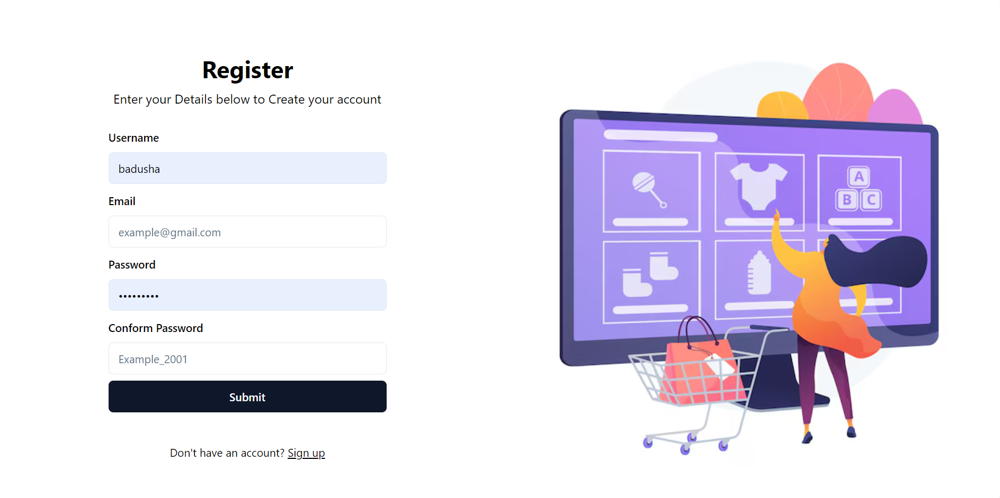
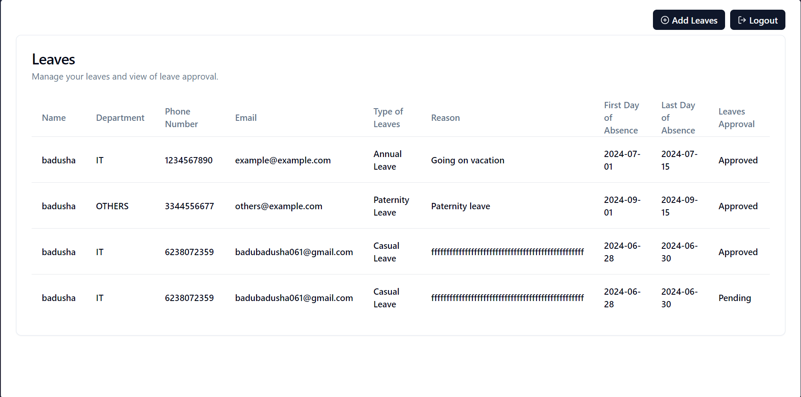
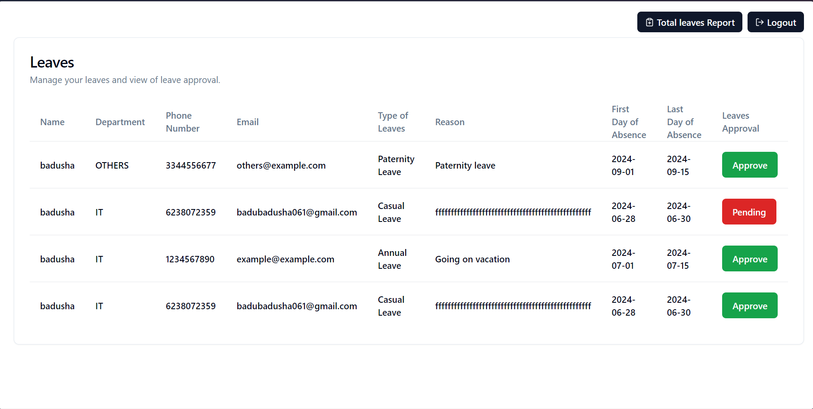

# Leave Application and Approval System Test







## Key Features

### User Authentication and Authorization
- **User Authentication Using JWT Token**: Users can authenticate using their username and password.
- **SMTP Verification**: Users can verify their accounts via email OTP.

### Leave Application Submission
- **Leave Application Submission**: Employees to submit leave requests.
- **Leave status**: Allowing managers to review and approve or reject leave requests submitted.
- **Total leaves Report**: Total leaves applied by each employee.


### API Documentation

- **Comprehensive Documentation of API Endpoints**: [View API Documentation](https://documenter.getpostman.com/view/31242747/2sA3XV7eaQ)


## Getting Started

### Setup
1. **Clone the repository:**
    ```bash
    git clone https://github.com/badusha061/Leave-Application-and-Approval-System-Test.git
    ```

2. **Navigate to the project folder for backend:**
    ```bash
    cd server
    ```

3. **Configure environment variables as instructed in the provided `.env.example` file.**

4. **Set up virtual environment:**
    ```bash
    python -m venv venv 
    venv\Scripts\activate
    ```

5. **Install all dependencies for Server:**
    ```bash
    pip install -r requirements.txt
    python manage.py migrate 
    python manage.py runserver
    ```

6. **Navigate to the project folder for frontend:**
    ```bash
    cd client
    ```

7. **Install all dependencies for frontend:**
    ```bash
    npm i 
    npm run dev
    ```

## Technology Stack
- **Backend Development**: Python, Django REST framework, ORM
- **Databases**: PostgreSQL
- **Frontend Development**: React, TypeScript, Tailwind CSS, shadcn UI
- **Integrations**: JWT
